# BPCAgent 技术报告

**日期：2026-10-01｜对象：当前工作区源码｜包版本：0.1.0**

## 摘要

BPCAgent 已实现一个同步 Agent 开发框架：统一解析配置，通过 OpenAI 兼容的 Chat Completions 接口请求模型，读取原生 `tool_calls`，在本地校验并执行工具，然后将实际结果回传给模型。当前提供 `BasicAgent`、`ReActAgent`、对象工具与函数工具，以及计算器示例。

核心职责分为三层：**模型客户端负责请求与响应转换，Agent 负责运行循环，工具注册表负责校验与执行。** 两类 Agent 使用同一工具循环，主要差异是提示策略和历史使用方式。目前尚未实现多智能体调度、Workflow 编排、异步工具循环和独立工具总次数预算。

本报告依据当前工作区文件编写，包含尚未提交的修改；不以历史改进计划代替实际实现。编写时重新运行了 57 项离线测试，全部通过。真实服务验证引用此前已记录的结果，本次未重新请求模型。图示使用 Mermaid，可在支持 Mermaid 的 Markdown 阅读器中查看。

### 阅读顺序

- **第 1 节**：目录结构与模块职责。
- **第 2 节**：逐模块逻辑流程与重要类。
- **第 3 节**：按运行阶段组织的模块交互。
- **第 4 节**：接口、历史和异常边界。
- **第 5 节**：验证证据与当前能力范围。

## 1. 结构与职责

### 1.1 目录结构

```text
BPCAgent/
├── pyproject.toml                  # 包元数据与构建配置
├── requirements.txt               # 运行、示例及构建依赖
├── src/bpcagent/
│   ├── __init__.py                 # 顶层公共接口
│   ├── agents/
│   │   ├── __init__.py             # Agent 相关接口导出
│   │   ├── config.py               # 配置解析与校验
│   │   ├── messages.py             # 消息、工具请求、模型响应
│   │   ├── models.py               # 模型客户端
│   │   ├── agents.py               # Agent 策略与执行循环
│   │   └── exceptions.py           # 框架异常类型
│   └── tools/
│       ├── __init__.py             # 工具相关接口导出
│       ├── tool.py                 # 工具抽象、注册、校验与执行
│       └── calculator.py           # 计算器参数与实现
├── examples/
│   ├── single_qa.py                # 离线或真实模型问答与工具验证
│   └── tool_execution.py           # 不经过模型的工具执行示例
├── test.ipynb                     # 交互式计算器调用验证
└── tests/                         # 离线单元及集成测试
```

### 1.2 模块职责与数据流

**图 1：运行时职责关系。实线表示主要调用或数据传递，虚线表示数据结构或异常依赖。**

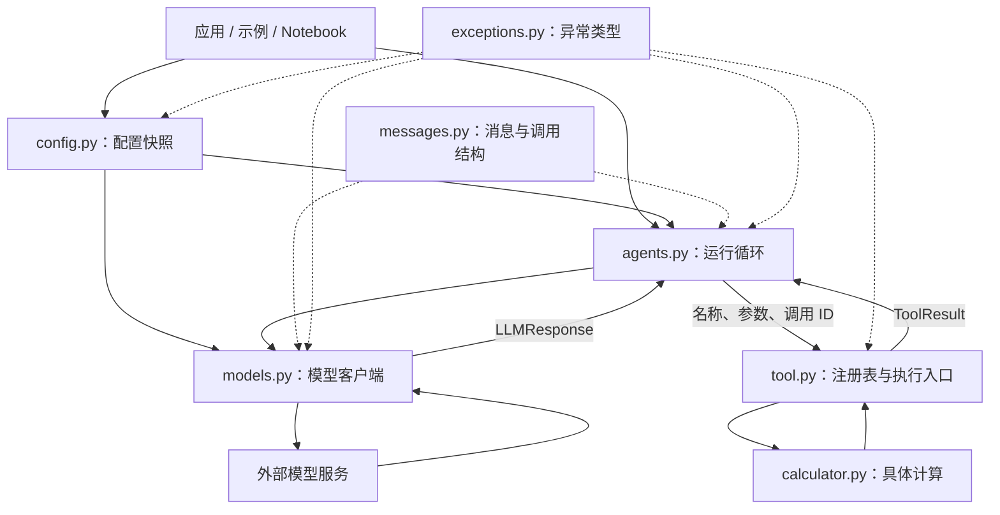

工具执行发生在本地 Python 进程。发送给模型的是工具名称、描述和参数 Schema，具体函数实现由注册表保存，不会随工具定义自动上传。

两个子包是职责分组，尚不是完全独立的依赖层：`agents/agents.py` 使用 `tools`，`tools/tool.py` 使用 `agents/exceptions.py`。

## 2. 各模块逻辑与重要类

### 2.1 包入口：三个 `__init__.py`

源码：[顶层入口](src/bpcagent/__init__.py)、[agents 入口](src/bpcagent/agents/__init__.py)、[tools 入口](src/bpcagent/tools/__init__.py)。

这些文件导入并通过 `__all__` 导出公共类，本身不创建模型客户端、注册工具或发起网络请求。

**图 2：公共接口解析路径；表示接口组织，不表示模型执行顺序。**

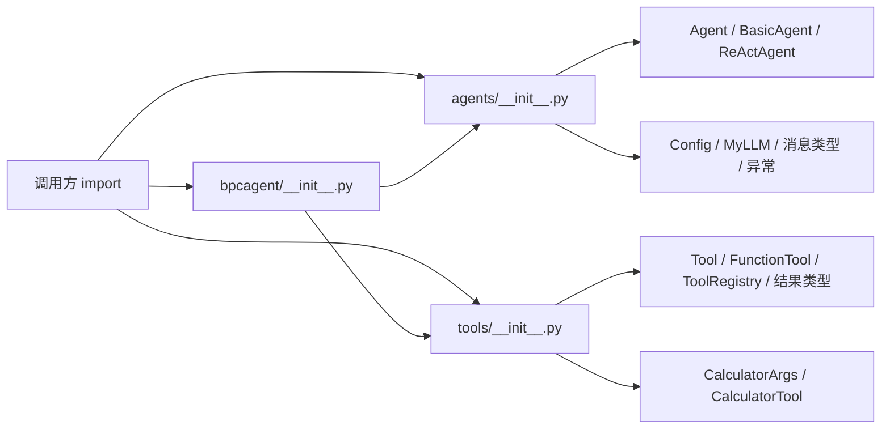

推荐导入方式：

```python
from bpcagent.agents import BasicAgent, Config, MyLLM
from bpcagent.tools import CalculatorTool, ToolRegistry
```

顶层也导出主要开发接口；异常可从 `bpcagent.agents` 或 `bpcagent.agents.exceptions` 导入。`pyproject.toml` 使用 `src` 布局并发现 `bpcagent*` 子包。

### 2.2 配置模块：`agents/config.py`

源码：[config.py](src/bpcagent/agents/config.py)。

**重要类：`Config`。** 基于 Pydantic 定义字段、合并来源并生成不可直接赋值的配置对象。它不自动读取 `.env` 文件；示例通过 `load_dotenv()` 先把文件内容加载到进程环境。

**图 3：`Config.resolve()` 的配置合并流程。**

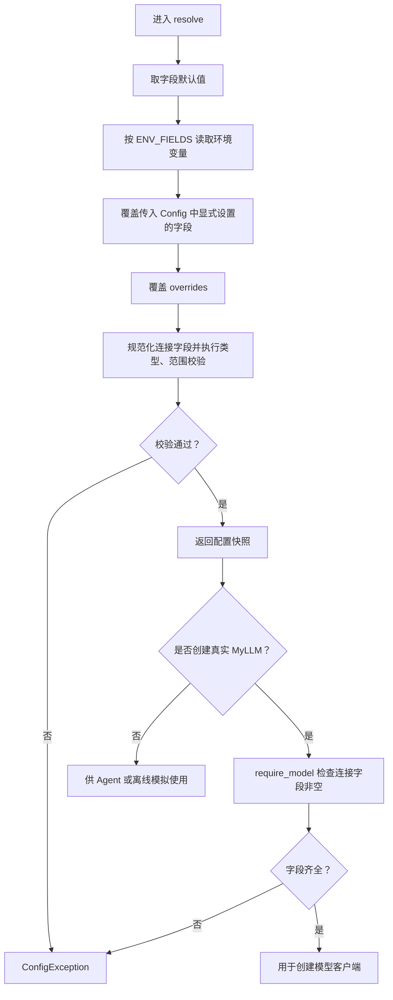

| 字段组 | 字段与默认值 | 实际用途 |
| --- | --- | --- |
| 连接 | `model=None`、`api_key=None`、`base_url=None` | 创建真实客户端时要求非空；密钥用 `SecretStr` 保存 |
| 请求 | `temperature=0.7`、`max_tokens=None`、`timeout=120` | 发送给 SDK；可选参数为 `None` 时省略，超时必须大于零 |
| 执行 | `max_tool_iterations=3`、`max_steps=5` | 分别限制 BasicAgent 和 ReActAgent 的模型交互轮次 |
| 预留 | `default_provider="openai"`、`log_level="INFO"`、`max_history_length=100` | 尚未接入提供方切换、日志级别控制和历史裁剪 |

主要方法与约束：

- `resolve(config, overrides, environ)`：优先级为 `overrides > Config 显式字段 > 环境变量 > 默认值`。`environ=None` 读取进程环境，`environ={}` 禁用环境读取。
- `normalize_text()`：清理连接字段的首尾空白，空字符串转为 `None`。
- `reject_boolean_numbers()`：拒绝把 `True/False` 当作数字；正数、有限数等约束由字段声明补充。
- `require_model()`：检查连接字段存在，不验证密钥有效性、服务可达性或模型能力。
- `to_dict()`：返回 JSON 兼容的脱敏展示数据，不能用于恢复真实密钥。

`Config(...)` 只创建并校验对象，不自动合并环境。直接构造时校验失败是 Pydantic `ValidationError`；通过 `resolve()` 合并后校验失败会包装成 `ConfigException`。

### 2.3 消息模块：`agents/messages.py`

源码：[messages.py](src/bpcagent/agents/messages.py)。

| 重要类 | 核心字段 | 作用 |
| --- | --- | --- |
| `ToolCall` | `id`、`name`、`arguments` | 表示模型提出的函数调用；参数保留原始 JSON 字符串 |
| `LLMResponse` | `content`、`tool_calls`、`finish_reason` | 表示一次模型响应；检查同批调用 ID 唯一 |
| `Message` | `role`、`content`、`tool_calls`、`tool_call_id`、`timestamp`、`metadata` | 表示对话消息，校验角色与字段关系，并转换为 API 字典 |

**图 4：结构化响应与消息转换。**

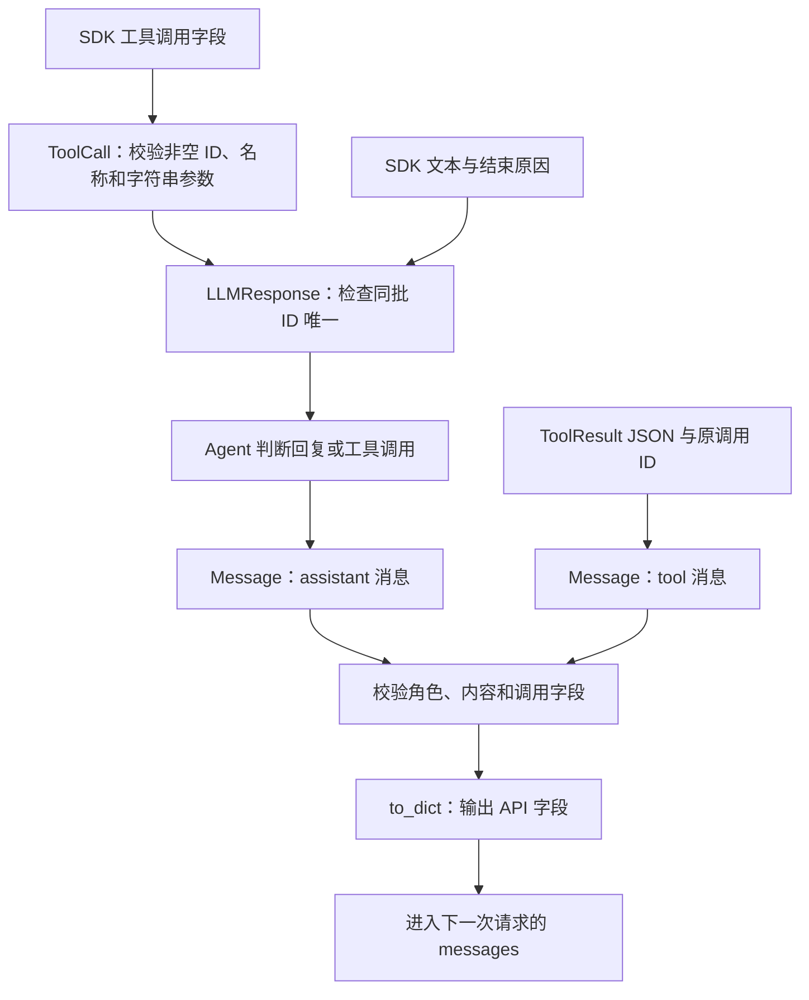

约束如下：

- 只有 assistant 消息可以携带非空 `tool_calls`。
- tool 消息必须携带 `tool_call_id`，其他角色不能携带该字段。
- 只有携带工具调用的 assistant 消息允许 `content=None`。
- `Message.to_dict()` 不发送 `timestamp` 和 `metadata`。
- `ToolCall.to_dict()` 输出 `id/type/function` 格式；`function` 中包含名称与原始参数字符串。

**职责边界：**这些类校验单个对象或同批调用，尚未验证整个会话中所有请求与结果是否配对；运行循环负责按顺序建立配对。`LLMResponse` 也不判断结束原因是否可以继续执行，这由 Agent 完成。

### 2.4 模型模块：`agents/models.py`

源码：[models.py](src/bpcagent/agents/models.py)。

**重要类：`MyLLM`。** 封装 OpenAI SDK 客户端，负责请求参数整理与响应转换，不负责执行工具、保存 Agent 历史或决定循环终止。

**图 5：客户端初始化与非流式模型调用。**

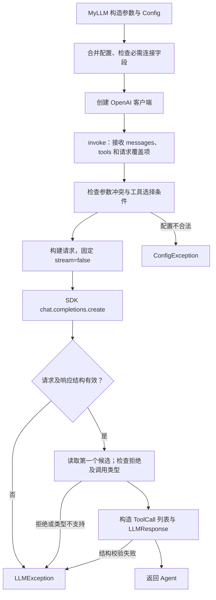

| 方法或成员 | 用途 |
| --- | --- |
| `__init__()` | 合并显式构造参数与 Config，复制附加请求默认参数，创建客户端 |
| `_UNSET` | 区分未传请求参数与显式 `None`；`temperature/max_tokens=None` 表示省略 |
| `_REQUEST_FIELDS` | 允许单次覆盖的 Config 请求字段：`temperature`、`max_tokens`、`timeout` |
| `_check_request_options()` | 阻止从请求参数改写连接、Agent 配置及入口控制字段 |
| `_build_request_params()` | 深复制默认参数与覆盖项，基于配置快照构建请求，不重新读取环境 |
| `invoke()` | 返回 `LLMResponse`；接收本次 `tools` 和 `tool_choice` |
| `think()` | 返回文本片段迭代器；名称不表示访问模型内部推理过程 |

对于可覆盖的请求字段，最终优先级为：**单次请求 > 显式模型构造参数 > Config 显式字段 > 环境变量 > 默认值**。`model/api_key/base_url` 不支持单次请求覆盖；连接构造参数为 `None` 时不覆盖其他来源。

工具参数必须在请求时提供，不能作为模型构造默认值，也不能藏在 `extra_body` 中。没有工具时省略 `tools`；没有非空工具列表却指定工具选择参数会报错。`tool_choice` 的实际支持范围由当前服务决定。

`invoke()` 只读取第一个响应候选，未提供多候选选择策略、用量统计或供应商特有响应字段的完整保留机制。请求异常及响应解析异常包装为 `LLMException` 并保留异常链；构造客户端时的 SDK 异常不在该请求包装范围内。

### 2.5 Agent 模块：`agents/agents.py`

源码：[agents.py](src/bpcagent/agents/agents.py)。

| 重要类 | 核心职责 |
| --- | --- |
| `Agent` | 抽象基类；默认按 Config 创建模型并复用其配置，保存历史，提供响应检查、工具执行和共享循环 |
| `BasicAgent` | 创建 system、历史和 user 消息；提供普通问答、工具循环和文本流入口 |
| `ReActAgent` | 将策略提示与系统提示组合；每次重新建立运行消息，使用共享工具循环 |

**图 6：两类 Agent 的入口差异。**

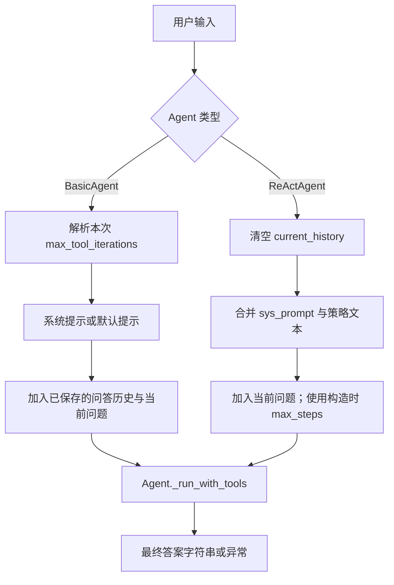

**图 7：共享运行循环。**

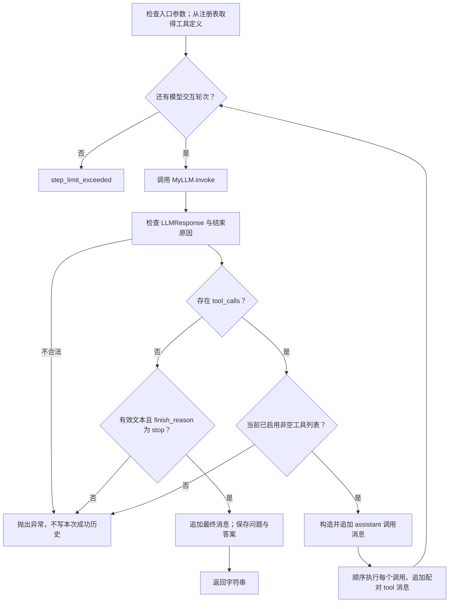

主要方法：

- `_invoke_response()`：要求返回 `LLMResponse`；仅接受 `stop/tool_calls` 结束原因。有调用时允许空文本；没有调用时必须是非空文本且正常结束。
- `_execute_tool_call()`：先解码完整 JSON 对象，再把名称、参数和原调用 ID 交给注册表。无效 JSON、重复键、非有限数值和多余尾部内容转为 `invalid_arguments`。
- `_run_with_tools()`：每轮调用模型一次；一次回复中的多个工具按顺序执行，全部结果加入消息后再请求模型。
- `add_message()/get_history()/clear_history()`：管理长期会话历史；`get_history()` 返回列表浅拷贝，内部 Message 对象未深复制。
- BasicAgent 的 `add_tool()/remove_tool()/list_tools()`：委托注册表管理工具。`has_tools()` 检查开关及注册表是否存在，不保证注册表内有工具。

**两类 Agent 没有两套工具执行算法。** ReAct 的差异体现在策略提示与每次运行重建历史；当前不要求输出 `Thought/Action/Finish` 文本，也不获取模型内部推理过程。

### 2.6 工具基础模块：`tools/tool.py`

源码：[tool.py](src/bpcagent/tools/tool.py)。

| 重要类 | 作用与关键约束 |
| --- | --- |
| `ToolArgs` | 参数模型基类；严格类型、拒绝额外字段、校验默认值、拒绝非有限数值 |
| `Tool` | 抽象工具；保存名称和描述，要求 `args_schema` 与 `run(parameters)` |
| `FunctionTool` | 包装同步函数；检查签名，按参数字段名传入关键字参数 |
| `ToolRegistry` | 用一个名称到工具对象的字典管理注册、查询、删除、Schema 导出和执行 |
| `ToolError` | 保存错误码与描述 |
| `ToolResult` | 保存调用 ID、工具名、状态、结果和错误；校验成功与失败字段的一致性 |

**图 8：工具注册与 Schema 导出。**

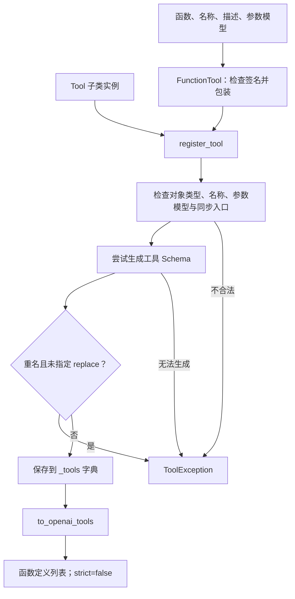

`Tool.to_openai_tool()` 从 `args_schema.model_json_schema()` 生成参数 Schema，并封装名称、描述和 `type="function"`。服务端 `strict=False` 与本地 Pydantic 严格校验是两项独立设置。

`FunctionTool` 禁止位置专用参数、`*args` 和 `**kwargs`，要求函数能接收参数模型中的全部字段。执行时使用 `getattr()` 取字段值，嵌套参数仍是 Pydantic 对象，不被提前展开成普通字典。

**图 9：统一工具执行。**

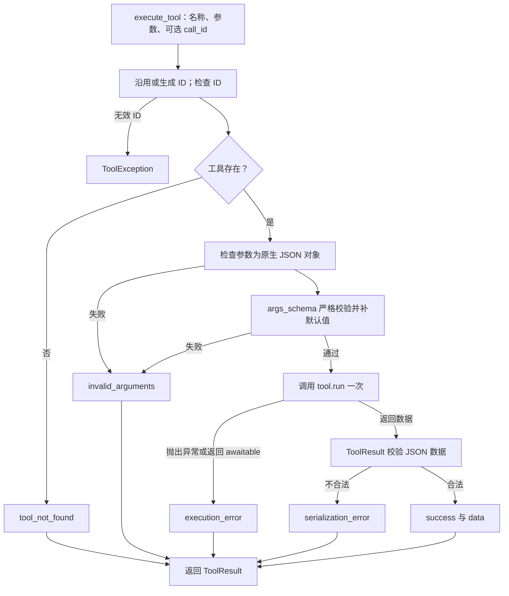

关键执行语义：

- Agent 传入模型的调用 ID；直接调用注册表时，未提供 ID 才自动生成。
- 参数错误发生在工具执行前；结果序列化错误发生在工具执行后。
- 支持结果为 `None`、布尔值、整数、有限浮点数、字符串，以及由这些值组成的列表和字符串键字典。
- 工具返回包含“错误”字样的普通字符串仍是成功数据；失败必须抛出异常或由框架产生错误结果。
- 注册表不自动重试工具。错误结果反馈模型后，模型可以在下一轮再次提出请求，这会形成新的实际执行。
- `ToolResult.failure()` 将错误描述截断至 500 个字符；成功数据尚无大小上限。

### 2.7 计算器模块：`tools/calculator.py`

源码：[calculator.py](src/bpcagent/tools/calculator.py)。

**`CalculatorArgs`** 定义必填的非空白字符串 `input`。**`CalculatorTool`** 的注册名称为 `calculate`，`run()` 接收已校验参数，通过 AST 递归求值，返回整数或浮点数。

**图 10：计算器求值流程。**

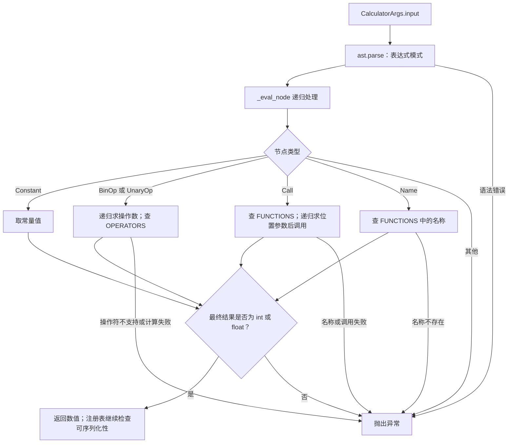

当前映射包括加、减、乘、除、幂、按位异或、负号，以及部分数学函数和常量。`**` 表示幂，`^` 表示按位异或。AST 分支只实现有限节点，不能据函数映射中出现某个名称就推断支持全部 Python 调用形式，例如列表字面量不在当前求值分支中。

该实现没有使用 Python `eval()`，但也不是完整的资源隔离环境：没有表达式长度、递归深度、计算耗时或内存预算。`run()` 中的测试输出仍保留，正常调用时会显示在控制台。

### 2.8 异常模块：`agents/exceptions.py`

源码：[exceptions.py](src/bpcagent/agents/exceptions.py)。

`BasicException` 是共同基类；`ConfigException`、`LLMException`、`AgentException`、`ToolException` 均为其子类。目前这些类没有专门的状态码字段。

**图 11：异常与工具错误结果的分流。**

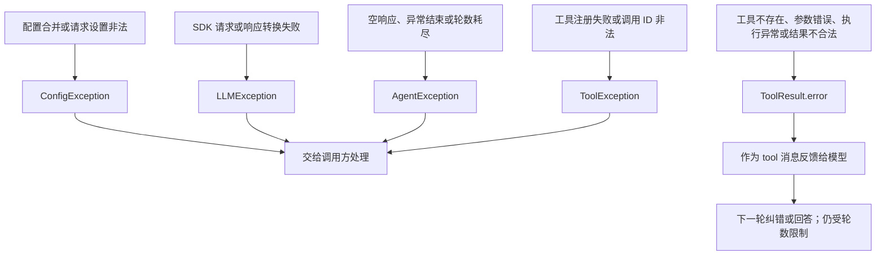

这里有两个错误通道：**异常终止程序入口，工具错误结果参与模型交互。** 工具执行阶段捕获的普通异常统一归为 `execution_error`，尚未区分可恢复与必须立即终止的失败。直接构造 Pydantic 对象等底层操作仍可能抛出原生异常，框架并未包装所有异常路径。

## 3. 按运行阶段组织的模块交互

### 3.1 阶段 A：配置、模型和工具初始化

**图 12：应用启动时序。**

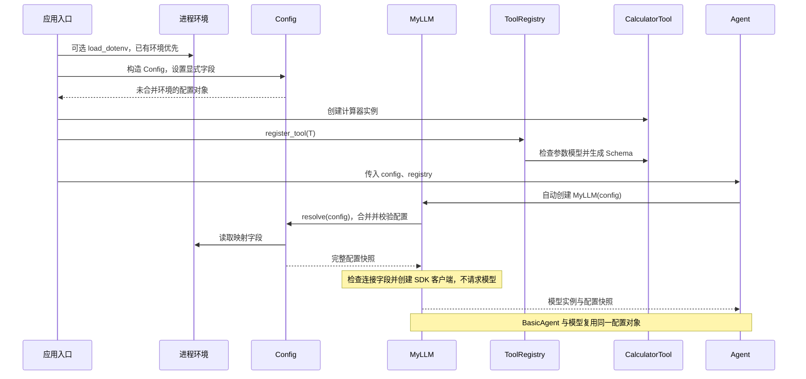

默认路径只需创建 Agent；`MyLLM` 完成一次配置解析，BasicAgent 复用其快照。不传 Config 时使用环境变量与默认值。测试或自定义模型可以显式传入 `llm`，此时不自动创建模型，Agent 单独解析执行配置，不改写已有模型。ReAct 仅同步可选 llm 接口；其显式 max_steps 仍在构造时覆盖 Agent 执行配置。

### 3.2 阶段 B：用户输入到第一次模型响应

**图 13：以 BasicAgent 为例的请求形成过程。**

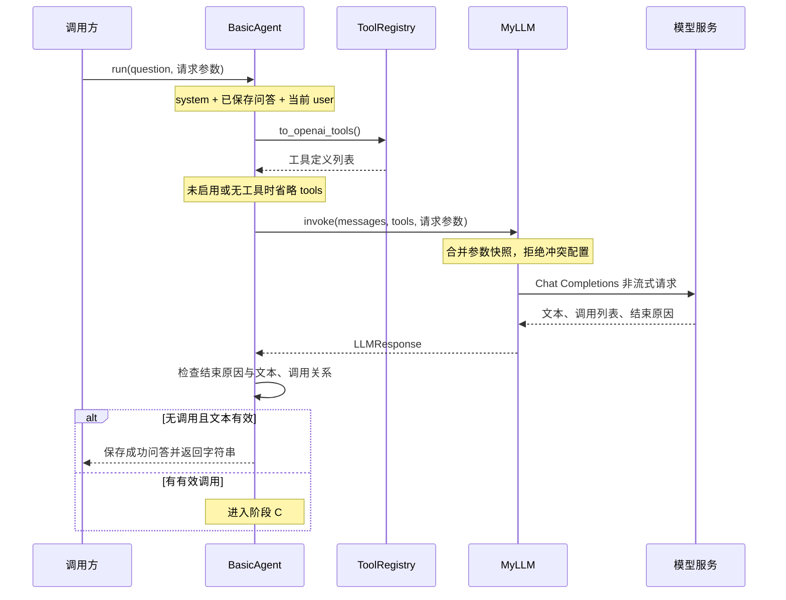

工具定义在共享循环入口生成一次，在本次运行的各轮复用。Agent 不能通过 `run(..., tools=...)` 绕过注册表。ReActAgent 的请求路径相同，但初始消息只包含组合后的策略提示与当前问题。

### 3.3 阶段 C：模型请求工具到最终回答

以下展示一次调用；多调用时重复执行与结果回传步骤，并在全部结果加入消息后统一请求模型。

**图 14：原生工具调用闭环。**

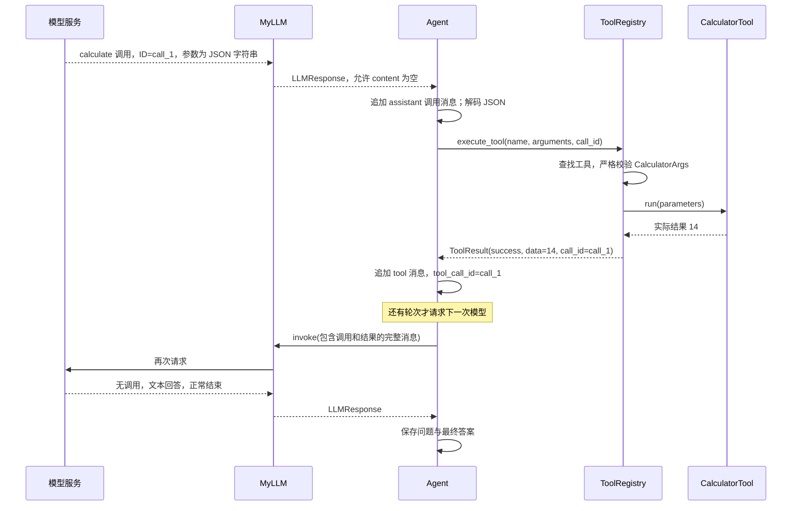

**同一调用的三个 ID 必须一致：**`ToolCall.id` → `ToolResult.call_id` → tool 消息的 `tool_call_id`。工具名只用于选择实现，不能代替调用 ID。

下面是说明性消息片段，展示真实结果如何进入模型上下文：

```json
[
  {
    "role": "assistant",
    "content": null,
    "tool_calls": [{
      "id": "call_1",
      "type": "function",
      "function": {"name": "calculate", "arguments": "{\"input\":\"2+3*4\"}"}
    }]
  },
  {
    "role": "tool",
    "tool_call_id": "call_1",
    "content": "{\"call_id\":\"call_1\",\"tool_name\":\"calculate\",\"status\":\"success\",\"data\":14,\"error\":null}"
  }
]
```

发生工具参数错误时，工具不执行；同一 ID 对应的结果改为 `status="error"`。模型随后可能修正参数，也可能直接解释失败。框架保证执行反馈的结构，不保证模型一定纠错成功。

### 3.4 阶段 D：完成、终止与历史保存

| 状态 | 执行结果 | 历史影响 |
| --- | --- | --- |
| 无调用、正常结束、有效文本 | `run()` 返回字符串 | 追加当前 user 和最终 assistant 至 `_history` |
| 有工具调用 | 顺序执行并回传结果 | 中间消息保存在本次运行消息列表 |
| 空文本且没有调用 | 抛出 `AgentException` | 不追加本次成功问答 |
| 截断、过滤或不接受的结束原因 | 终止执行 | 不追加本次成功问答 |
| 轮数耗尽 | 抛出 `step_limit_exceeded` | 不追加本次成功问答；已执行工具不会回滚 |
| 工具自身失败 | 返回错误结果，允许继续下一轮 | 保留在本次消息中，等待模型处理 |

`max_tool_iterations` 和 `max_steps` 都包含生成最终答案的那一轮。最后允许的一轮如果仍要求调用工具，当前代码会执行这些工具、追加结果，然后因没有下一轮而抛出异常；不会额外请求一次模型来总结。

### 3.5 文本流式分支

**图 15：`BasicAgent.run_using_stream()` 与 `MyLLM.think()`。**

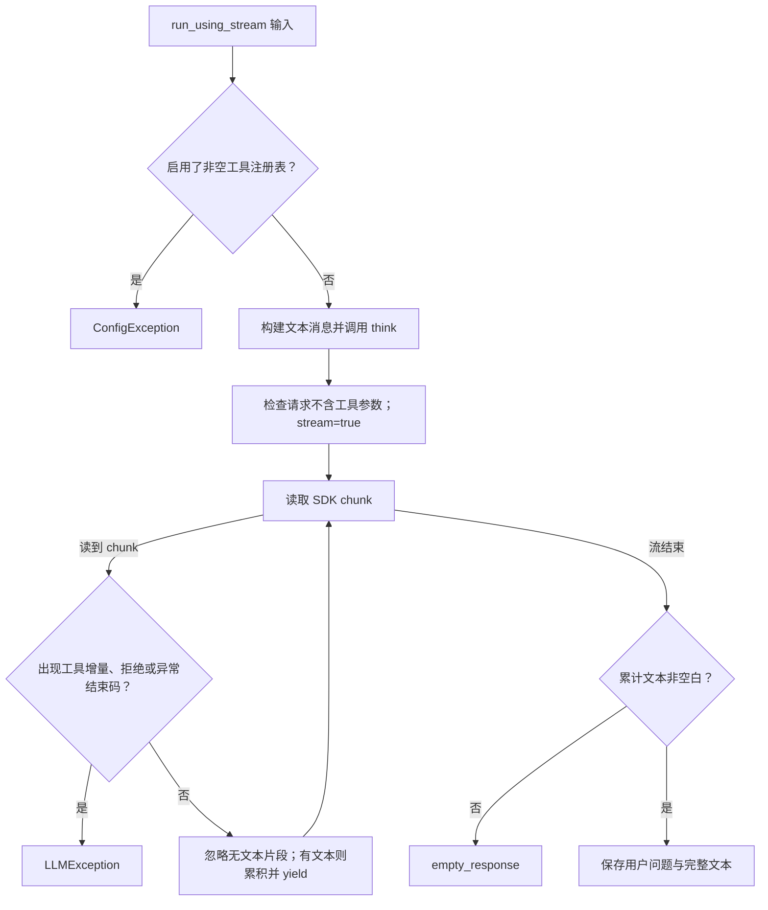

该分支没有工具循环。未设置 `sys_prompt` 时，它不会像普通 `run()` 一样补默认 system 提示。调用方必须完整消费生成器，才能到达历史保存步骤；途中出错时已经输出的片段不会撤回。

当前会拒绝显式异常结束码，但未强制要求流最后一定收到 `finish_reason="stop"`。因此“有内容后流结束”不等于已经实现了完整的流终止协议校验。

### 3.6 示例与测试入口

源码：[single_qa.py](examples/single_qa.py)、[tool_execution.py](examples/tool_execution.py)、[test.ipynb](test.ipynb)。

**图 16：辅助入口的运行路径。**

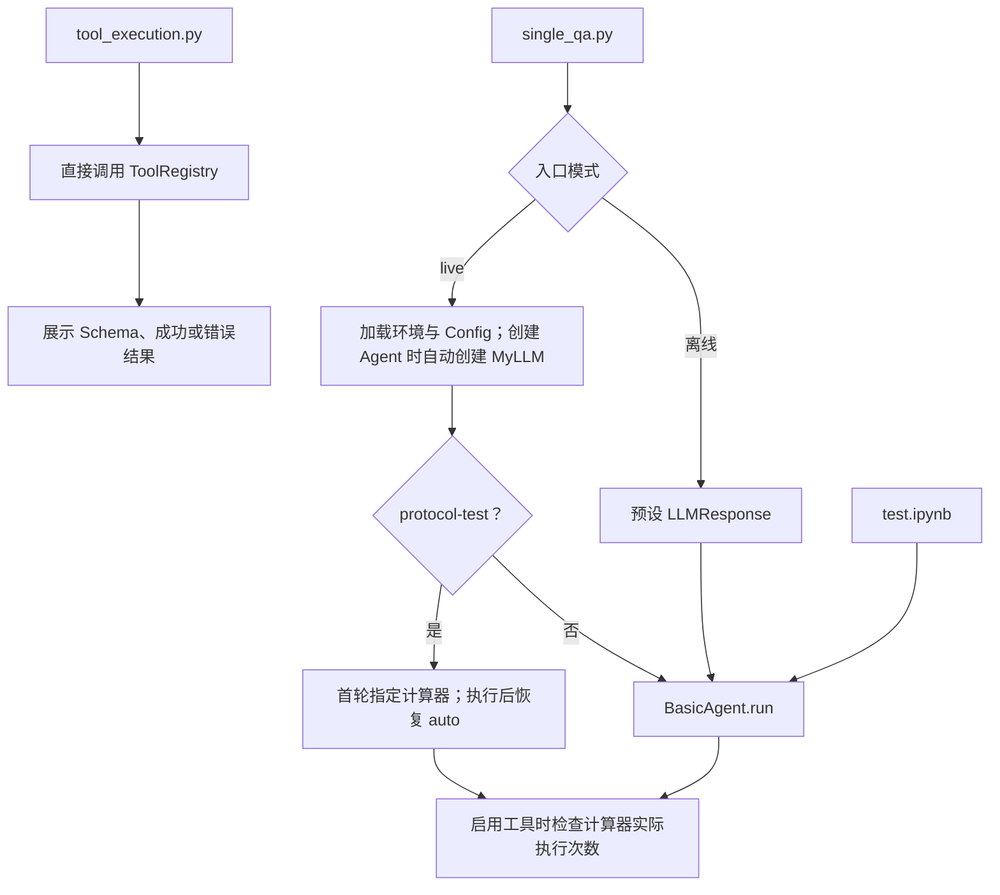

- 离线问答模拟模型，但工具执行是真实 Python 调用。
- 普通 live 示例使用模型默认工具选择；答对数值但没有执行计算器，不算工具验证通过。
- `protocol-test` 是独立的两请求协议检查，不运行 Agent 的多轮循环；其参数使用普通 `json.loads()`，不代表 Agent 严格 JSON 解码器的全部校验能力。该分支也不写入 Agent 会话历史。
- `tool_execution.py` 展示对象工具、函数工具、嵌套参数和默认值，不请求模型。

## 4. 接口与运行边界汇总

### 4.1 数据在各层之间的形式

| 边界 | 数据形式 | 校验责任 |
| --- | --- | --- |
| 应用 → 配置 | 环境变量、Config、覆盖字典 | Config 类型与范围校验 |
| Agent → 模型 | 消息字典列表、工具 Schema、请求参数 | MyLLM 参数冲突与请求构造 |
| 模型 → Agent | `LLMResponse`，内含 `ToolCall` | 模型层结构转换；Agent 判断结束状态 |
| 调用参数 → 注册表 | JSON 字符串先解析为字典 | Agent 拒绝非法 JSON；ToolArgs 校验具体字段 |
| 注册表 → 工具 | 已校验的参数模型实例 | 具体工具执行任务 |
| 工具 → 注册表 | 原生结果或异常 | ToolResult 校验返回数据并包装错误 |
| Agent → 模型反馈 | assistant 调用消息 + 配对 tool 消息 | 共享循环负责顺序和 ID 对应 |
| Agent → 调用方 | 最终答案字符串或异常 | 调用方决定展示及后续任务 |

### 4.2 两种历史的区别

| 对象 | 内容 | 生命周期及用途 |
| --- | --- | --- |
| `Agent._history` | 默认由框架保存的成功问答对 | 跨 `run()` 保留；BasicAgent 注入后续请求；可手动清空 |
| BasicAgent 本次 `messages` | 系统、旧问答、当前问题、调用、结果、最终答案 | 局部列表；结束后未作为详细运行记录提供 |
| `ReActAgent.current_history` | 当前系统提示、问题、调用、结果和最终答案 | 每次 `run()` 重建；上次会话不自动注入 |

没有写入成功历史，不等于工具没有运行。异常终止之前发生的外部副作用不会自动撤销。当前也没有持久化检查点或失败恢复机制。

### 4.3 预算、选择与并发

1. 一轮只有一次框架级 `invoke()`，但可包含多个工具；轮数上限不是工具执行总次数上限。
2. SDK 可能有自身重试，实际 HTTP 请求次数不由当前 Agent 轮数单独决定；统一重试预算尚未实现。
3. 工具按顺序执行，不因响应中有多个调用就并行。当前没有异步调度、取消或工具超时机制。
4. 单次 `run()` 的 `tool_choice` 参数在各轮复用，持续强制调用可能使模型无法自行返回最终答案。
5. `_history`、`current_history` 和注册表均含可变状态，未提供同一实例上的并发运行保护。
6. 参数结构合法不代表任务语义正确；原生调用协议不能保证工具选择、分析结论或模型回答一定正确。

## 5. 验证证据与项目进展

### 5.1 本次重新执行的离线测试

在现有 Conda 环境执行 `unittest` 测试发现，结果为 **57 项测试通过**。测试数量按测试方法计，部分方法内部包含多个子用例。

| 测试文件 | 数量 | 主要覆盖 |
| --- | ---: | --- |
| [test_config.py](tests/test_config.py) | 7 | 配置来源优先级、范围、快照、密钥展示 |
| [test_messages.py](tests/test_messages.py) | 3 | 消息序列化、角色约束、调用 ID |
| [test_models.py](tests/test_models.py) | 9 | 请求参数、模型返回、流式文本及异常 |
| [test_agents.py](tests/test_agents.py) | 19 | 两类 Agent、历史、多调用、连续工具轮次、错误反馈与预算 |
| [test_tools.py](tests/test_tools.py) | 12 | 注册、函数包装、Schema、严格校验、结果序列化及计算器 |
| [test_tool_call.py](tests/test_tool_call.py) | 7 | 模拟 SDK 与真实本地计算器的整链路、协议错误、空流和提示策略 |
| **合计** | **57** | **离线通过，不代表全部边界或所有供应商均已覆盖** |

复现命令：

```bash
conda activate bpcagent
cd BPCAgent
python -B -m unittest discover -s tests -v
python -B examples/single_qa.py --with-tools
```

### 5.2 既有真实服务验证

依据当前 [README](README.md) 与此前执行记录：

- 当前配置的 `deepseek-flash` 默认工具选择曾返回原生 `calculate` 调用；本地计算器实际执行一次，结果为 14；回传后模型正常回答。
- 指定计算器的协议检查返回 HTTP 400：`Thinking mode does not support this tool_choice`。该结果说明当时的 Thinking 模式不支持这一指定方式，不能据此否定默认自动工具调用能力。
- 本次报告编写未重新联网验证；已有结果仅适用于当时的服务配置，不推导其他模型、严格 Schema 或并行调用能力。

### 5.3 已实现与待完善

| 领域 | 已实现 | 当前边界或待完善 |
| --- | --- | --- |
| 配置 | 统一入口、优先级、校验、配置快照 | 预留字段尚未全部生效 |
| 模型 | 原生函数工具请求与响应转换 | 用量、多候选及供应商扩展字段未完整处理 |
| Agent | 共享循环、两种提示与历史策略、轮数停止 | 独立工具总预算、统一停止结构、失败分类仍待补齐 |
| 工具 | 单一注册表、Pydantic 参数、结构化结果 | 服务端严格 Schema、执行资源限制及副作用控制未实现 |
| 历史 | 成功问答与 ReAct 本次消息 | 裁剪、持久化、详细运行结果与恢复未实现 |
| 流式与并发 | 普通文本流、空文本检查 | 流式工具、异步、取消及并发保护未实现 |
| 多智能体 | 可分别实例化多个 Agent | Agent 间通信、共享状态、节点依赖、调度与 Workflow 尚未实现 |

## 6. 结论

当前 BPCAgent 已形成可验证的同步工具调用闭环，能够通过统一配置创建模型和 Agent，并以原生工具协议调用开发者实现的工具。核心执行职责已经集中，计算器验证贯通了模型请求、参数校验、本地执行和结果回传。

该实现可以作为继续开发工具和 Agent 的基础。其当前成熟度应定位为**具备基本边界检查和离线测试的单 Agent 框架原型**。多智能体 Workflow 所需的调度、状态、预算、失败恢复和持久化仍需单独设计；本报告未将这些计划能力计入现有实现。
